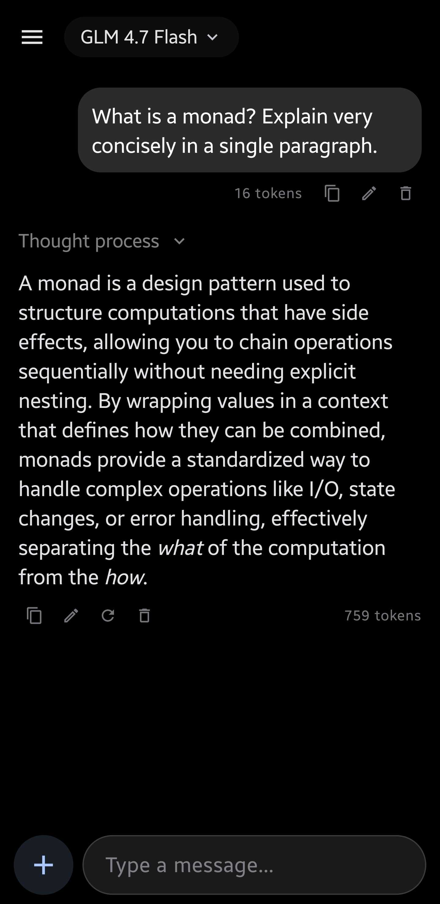

# Alpin Chat

A native Android chat app for local LLMs via OpenAI-compatible APIs. Designed to be a replacement for the ChatGPT app, strictly for personal use but open-sourced for anyone to use.

Material Design 3, with a built-in tokenizer for token counting (GLM-4 tokenizer only for now, as that's the model I use.)




## Build

**Requirements:**
- Android Studio Hedgehog or later
- JDK 17
- Android SDK 34
- NDK (for native tokenizer)

**Steps:**
```bash
git clone https://github.com/alpindale/AlpinChat.git
cd AlpinChat
./gradlew assembleDebug
```

The APK will be at `app/build/outputs/apk/debug/app-debug.apk`. You can either transfer it directly to your phone and install it, or use adb:

```bash
adb install app/build/outputs/apk/debug/app-debug.apk
```


## TODO
- [ ] Web Search
- [ ] Image Attachment